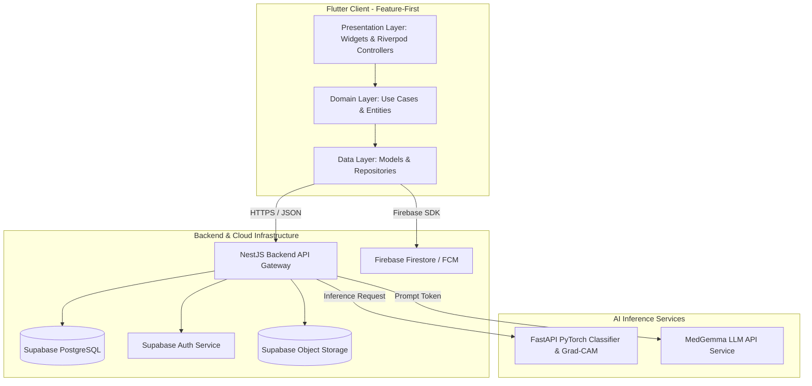
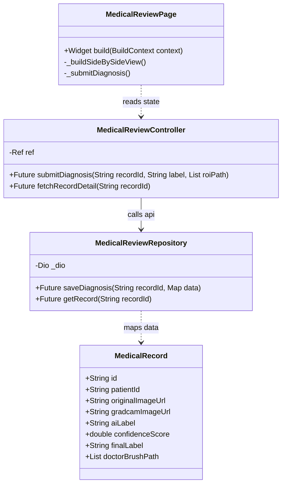
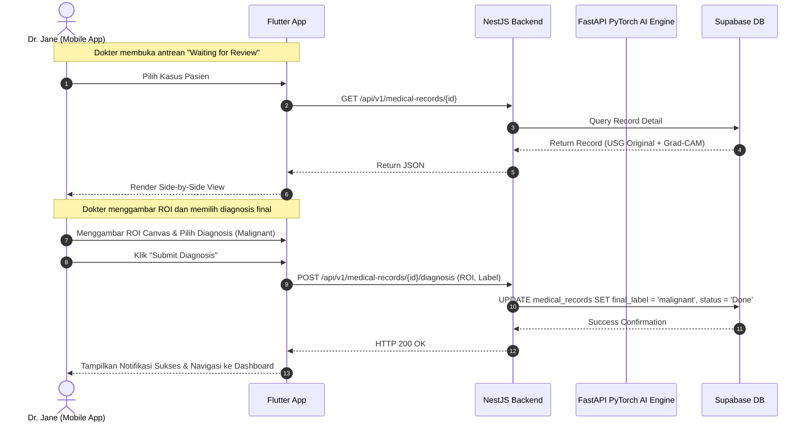
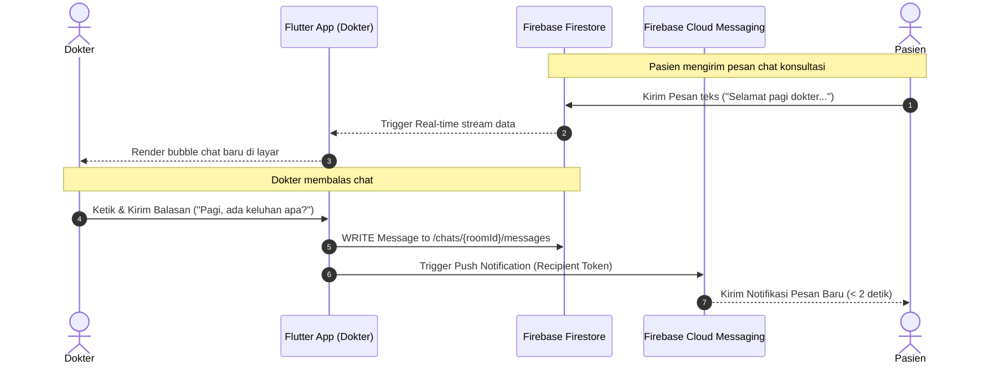
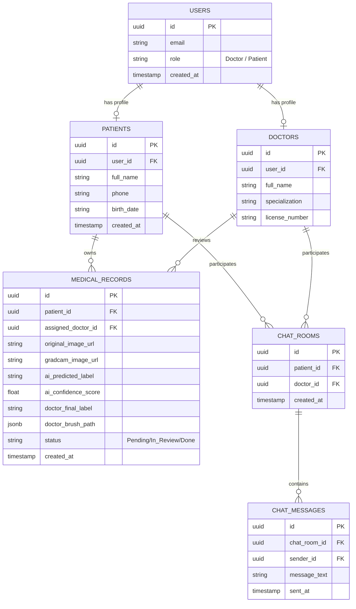
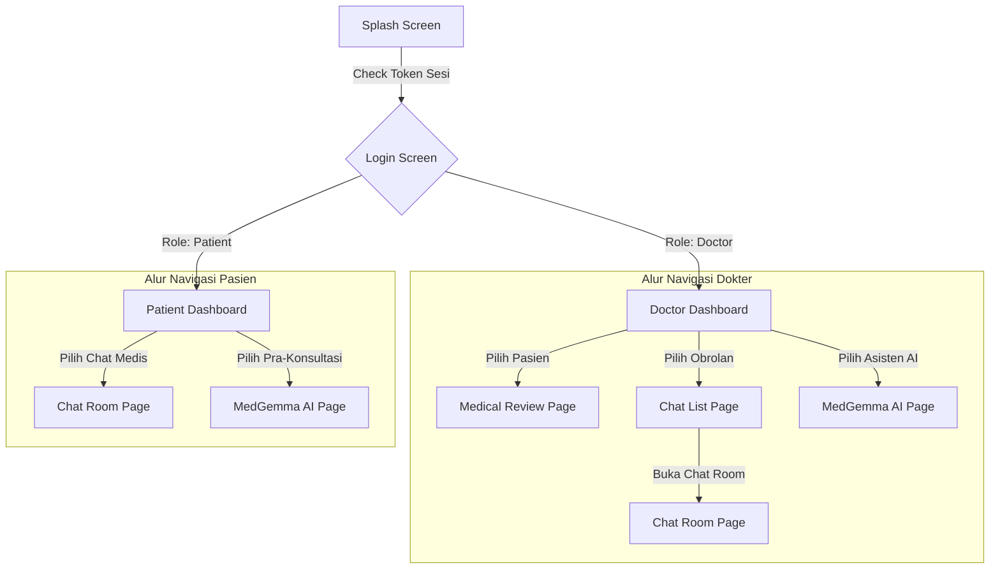
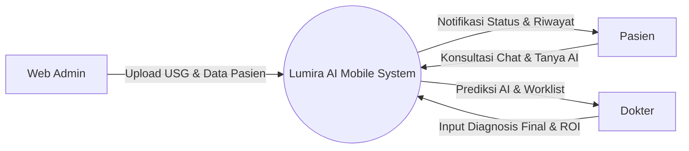
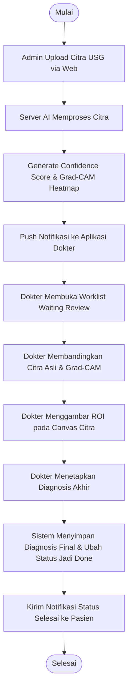

**COMPUTING PROJECT**  
**SOFTWARE DESIGN DOCUMENT**

**LUMIRA AI MOBILE: ENHANCED BREAST CANCER EARLY DETECTION PLATFORM**

![A logo with a red book and a black backgroundAI-generated content may be incorrect.][image1]

**Project Manager**  
Athila Ramdani Saputra		103012300132

**Team Members**  
Aprilianza Muhammad Yusup	103012300025  
Muhammad Irgiansyah		103012300039  
Arfian Ghifari Mahya   		103012300337  
Jeany Ferliza Nayla    		103012300357  
Gavin Benjiro Ramadhan	103012300452  
Bill Stephen Sembiring		103012330197

**Supervisor**  
WILDA ROYHAN, S.T., M.Kom.

**PROGRAM STUDI S-1 INFORMATIKA**  
**FAKULTAS INFORMATIKA – UNIVERSITAS TELKOM**  
**APRIL 2026**

---

# **Document Version**

| Versi | Tanggal | Perubahan | Penulis |
| :---- | :---- | :---- | :---- |
| 1.0 | 24 April 2026 | Initial SDD Release for Lumira AI Mobile | Kelompok 1 - S1 Informatika |

---

# **Table of Content**

1. [**Introduction**](#1-introduction)
   - [1.1 Purpose](#11-purpose)
   - [1.2 Scope of the System](#12-scope-of-the-system)
   - [1.3 References](#13-references)
2. [**System Architecture Design**](#2-system-architecture-design)
   - [2.1 Use Case Diagram](#21-use-case-diagram)
   - [2.2 High-Level Architecture Diagram](#22-high-level-architecture-diagram)
   - [2.3 Deployment Architecture](#23-deployment-architecture)
3. [**Module Design**](#3-module-design)
   - [3.1 Module List](#31-module-list)
   - [3.2 Module Description](#32-module-description-per-modul)
4. [**Class Diagram and Object Design**](#4-class-diagram-and-object-design)
   - [4.1 Class Diagram](#41-class-diagram)
   - [4.2 Object Interaction (Sequence Diagram)](#42-object-interaction)
5. [**Database Design**](#5-database-design)
   - [5.1 Entity Relationship Diagram (ERD)](#51-entity-relationship-diagram-erd)
   - [5.2 Database Schema Definitions](#52-database-schema-definitions)
6. [**User Interface Design (UI/UX)**](#6-user-interface-design-uiux)
   - [6.1 Wireframes / Mockups](#61-wireframes--mockups)
   - [6.2 Navigation Flow](#62-navigation-flow)
7. [**Data Flow and Process Flow**](#7-data-flow-and-process-flow)
   - [7.1 Data Flow Diagram (DFD)](#71-data-flow-diagram-dfd)
   - [7.2 Activity Diagram](#72-activity-diagram)
8. [**System Constraints**](#8-system-constraints)
9. [**Appendix**](#9-appendix)

---

# 1. **Introduction**

## 1.1 **Purpose**
Dokumen Software Design Document (SDD) ini disusun untuk memaparkan cetak biru (*blueprint*) arsitektur perangkat lunak, modul sistem, desain antarmuka, struktur kelas, dan skema database dari sistem **Lumira AI Mobile**. Dokumen ini digunakan sebagai pedoman utama bagi tim pengembang perangkat lunak, integrator sistem, dan database administrator (DBA) dalam mentranslasikan kebutuhan fungsional dari dokumen SRS ke dalam bentuk implementasi baris kode pemrograman.

## 1.2 **Scope of the System**
*   **Fungsi Utama**: Menyediakan antarmuka seluler untuk otentikasi berbasis RBAC, peninjauan citra medis (side-by-side USG dan Grad-CAM), penandaan ROI, penetapan diagnosis final oleh dokter, pelacakan kemajuan status diagnosis pasien secara real-time, real-time chat konsultasi klinis, dan asisten konsultasi cerdas chatbot MedGemma.
*   **User Utama**: Dokter Spesialis Radiologi/Onkologi dan Pasien Penderita Kanker Payudara.
*   **Benefit**: Diagnosis yang cepat, konsisten, dan akurat berbantuan kecerdasan buatan, visualisasi model deep learning yang transparan, hilangnya kesenjangan komunikasi dokter-pasien pasca-diagnosis, serta literasi kesehatan medis pasien yang meningkat.
*   **Platform**: Mobile Application (Lintas platform: Android dan iOS menggunakan framework Flutter).

## 1.3 **References**
*   Dokumen Software Requirement Specification (SRS) Lumira AI Mobile Versi 1.0.
*   Spesifikasi RESTful API dan OpenAPI 3.0 ekosistem Lumira AI Enhanced.
*   Panduan Pemrograman Flutter (Clean Architecture & Riverpod State Management).
*   Google DeepMind MedGemma LLM API Documentation.
*   Firebase Cloud Messaging & Firestore SDK Integration Guidelines.

---

# 2. **System Architecture Design**

## 2.1 **Use Case Diagram**
Use case berikut menggambarkan interaksi pengguna (Dokter dan Pasien) serta sistem eksternal (Admin via Web Portal) dengan sistem utama mobile.

```mermaid
leftToRightDirection
actor Dokter as Doc
actor Pasien as Pat
actor WebAdmin as Admin

rectangle "Lumira AI Mobile" {
    usecase "Otentikasi Akun (RBAC)" as UC_Auth
    usecase "Lihat Dashboard & Worklist" as UC_Worklist
    usecase "Review Citra USG & Grad-CAM" as UC_Review
    usecase "Gambar ROI & Input Diagnosis" as UC_Diag
    usecase "Chat Konsultasi Real-time" as UC_Chat
    usecase "Konsultasi MedGemma Chatbot" as UC_Bot
    usecase "Pantau Status Diagnosis" as UC_Track
}

Doc --> UC_Auth
Doc --> UC_Worklist
Doc --> UC_Review
Doc --> UC_Diag
Doc --> UC_Chat
Doc --> UC_Bot

Pat --> UC_Auth
Pat --> UC_Track
Pat --> UC_Chat
Pat --> UC_Bot

Admin -->|Upload Data & Citra via Web| UC_Worklist
```

## 2.2 **High-Level Architecture Diagram**
Lumira AI Mobile menggunakan pendekatan **Feature-First Clean Architecture** pada client-side yang terhubung dengan backend NestJS dan AI Server via REST API.



## 2.3 **Deployment Architecture**
*   **Client**: Aplikasi Flutter dikompilasi menjadi berkas biner asli (.apk untuk Android dan .ipa untuk iOS) dan didistribusikan melalui toko aplikasi seluler.
*   **Backend Server**: Menggunakan platform serverless **Vercel** (`https://apilumiraai.vercel.app`) yang meng-host API Gateway transaksional berbasis Express/NestJS untuk performa tinggi, auto-scaling, dan latency minimal.
*   **AI Chatbot Server**: Model LLM MedGemma dideploy pada server GPU lokal (Universitas Telkom) yang terhubung secara aman ke internet menggunakan secure tunnel **Cloudflare** (`https://tablet-pending-byte-julian.trycloudflare.com`) dengan otentikasi static bearer key untuk melayani request inferensi asisten cerdas.
*   **Database & File Storage**: Dikelola secara terpusat oleh platform as a service **Supabase** (PostgreSQL transaksional database dan Object Storage bucket untuk menyimpan berkas citra USG).
*   **Real-time Obrolan & Notifikasi**: Menggunakan NoSQL Firebase Cloud Database (Firestore) untuk sinkronisasi pesan instan secara real-time dan Firebase Cloud Messaging (FCM) untuk pengiriman notifikasi push saat aplikasi berada di latar belakang.
*   **CI/CD Pipeline**: Diotomatisasi menggunakan platform Git dan Vercel integrations untuk pembaruan backend otomatis, serta pengujian lokal di sisi Flutter client.

---

# 3. **Module Design**

## 3.1 **Module List**
Aplikasi mobile dibagi menjadi beberapa modul independen berbasis fitur (*Feature-First*):
1.  **Otentikasi (auth)**: Menangani pendaftaran sesi, simpan JWT token, dan RBAC.
2.  **Dashboard (dashboard)**: Menangani tampilan visual kartu statistik dokter, list riwayat, dan portal tracking pasien.
3.  **Review Medis (medical_review)**: Panel peninjauan citra usg, overlay Grad-CAM, annotasi ROI canvas, dan input diagnosis.
4.  **Komunikasi Obrolan (chat)**: Fitur real-time chat berbasis sinkronisasi data stream Firestore.
5.  **Asisten Pintar AI (ai_chatbot)**: Layanan asisten cerdas MedGemma chatbot multimodal.

## 3.2 **Module Description (per modul)**

### A. Modul 1: Authentication & Access Control (auth)
| Komponen | Deskripsi |
| :--- | :--- |
| **Nama Modul** | Authentication Module |
| **Tujuan** | Menyediakan validasi kredensial pengguna dan mengunci menu berdasarkan peran (RBAC). |
| **Input** | `email`, `password` (melalui input form text field). |
| **Output** | JWT Token, `user_role` (Doctor/Patient), navigasi rute ke dashboard. |
| **Dependency** | `supabase_flutter` (Supabase Auth Client), `flutter_secure_storage`. |
| **Catatan** | Token JWT disimpan secara aman di perangkat penyimpanan fisik lokal terenkripsi. |

### B. Modul 2: Medical Review & Diagnosis (medical_review)
| Komponen | Deskripsi |
| :--- | :--- |
| **Nama Modul** | Medical Review Module |
| **Tujuan** | Memfasilitasi dokter spesialis dalam meninjau prediksi AI, visualisasi panas Grad-CAM secara interaktif, menggambar ROI, dan memicu diagnosis final. |
| **Input** | `record_id`, koordinat sentuhan jari menggambar ROI pada layar, label diagnosis klinis (Normal/Benign/Malignant). |
| **Output** | REST request payload JSON berisi ROI koordinat dan status review diubah menjadi 'Done'. |
| **Dependency** | `CustomPainter` (untuk canvas ROI drawing), `patientDetailProvider`, `patientsControllerProvider`. |
| **Catatan** | Panel review menyediakan penggeser transparansi (*opacity slider*) untuk mengatur visibilitas Grad-CAM heatmap di atas gambar USG asli secara real-time. |

### C. Modul 3: MedGemma AI Chatbot (ai_chatbot)
| Komponen | Deskripsi |
| :--- | :--- |
| **Nama Modul** | AI Chatbot Module |
| **Tujuan** | Menyediakan obrolan interaktif multimodal dengan asisten medis cerdas MedGemma. |
| **Input** | `user_prompt` (teks), `chat_history` (maksimal 10 pesan terakhir), opsional `image_url` (citra medis). |
| **Output** | Teks respons klinis otomatis bertenaga MedGemma LLM. |
| **Dependency** | `aiChatbotProvider`, `Dio` HTTP Client. |
| **Catatan** | Gelembung chat menampilkan disclaimer otomatis di bagian bawah. |

---

# 4. **Class Diagram and Object Design**

## 4.1 **Class Diagram**
Class diagram berikut mendeskripsikan implementasi Feature-First Clean Architecture pada modul `medical_review`.



## 4.2 **Object Interaction (Sequence Diagram)**

### A. Alur Proses Inferensi AI & Medical Review oleh Dokter


### B. Alur Konsultasi Obrolan Real-time Chat


---

# 5. **Database Design**

## 5.1 **Entity Relationship Diagram (ERD)**
Skema ERD berikut menunjukkan relasi data rekam medis di database Supabase.



## 5.2 **Database Schema Definitions**

### A. Tabel `users` (Supabase Auth/Public)
| Field | Type | Description |
| :--- | :--- | :--- |
| `id` | UUID (PK) | Unique Identifier untuk otentikasi Supabase. |
| `email` | VARCHAR(150) | Alamat surat elektronik unik pengguna. |
| `role` | VARCHAR(30) | Peran otorisasi sistem: 'Doctor' atau 'Patient'. |
| `created_at` | TIMESTAMP | Tanggal dan waktu registrasi akun. |

### B. Tabel `patients` (Supabase Public Schema)
| Field | Type | Description |
| :--- | :--- | :--- |
| `id` | UUID (PK) | Unique Identifier rekam medis pasien di database. |
| `user_id` | UUID (FK) | Relasi ke tabel `users.id` untuk relasi kepemilikan akun. |
| `full_name` | VARCHAR(150) | Nama lengkap pasien. |
| `phone` | VARCHAR(20) | Nomor telepon aktif pasien. |
| `birth_date` | DATE | Tanggal lahir pasien. |
| `created_at` | TIMESTAMP | Tanggal pembuatan profil pasien. |

### C. Tabel `doctors` (Supabase Public Schema)
| Field | Type | Description |
| :--- | :--- | :--- |
| `id` | UUID (PK) | Unique Identifier profil dokter. |
| `user_id` | UUID (FK) | Relasi ke tabel `users.id` untuk relasi otentikasi login. |
| `full_name` | VARCHAR(150) | Nama lengkap beserta gelar medis dokter. |
| `specialization` | VARCHAR(100) | Spesialisasi klinis (misalnya: 'Spesialis Radiologi / Onkologi'). |
| `license_number` | VARCHAR(50) | Surat Izin Praktik (SIP) dokter resmi dari IDI. |

### D. Tabel `medical_records` (Supabase Public Schema)
| Field | Type | Description |
| :--- | :--- | :--- |
| `id` | UUID (PK) | Unique Identifier rekam medis pasien. |
| `patient_id` | UUID (FK) | Merujuk pada id profil tabel `patients`. |
| `assigned_doctor_id` | UUID (FK) | Merujuk pada id profil dokter penilai di tabel `doctors`. |
| `original_image_url` | TEXT | URL publik penyimpanan bucket Supabase untuk citra USG asli. |
| `gradcam_image_url` | TEXT | URL publik penyimpanan bucket Supabase untuk citra Grad-CAM heatmap. |
| `ai_predicted_label` | VARCHAR(50) | Label prediksi klasifikasi model AI (Normal/Benign/Malignant). |
| `ai_confidence_score` | FLOAT | Skor akurasi keyakinan model AI (0.0 s.d 100.0). |
| `doctor_final_label` | VARCHAR(50) | Label diagnosis akhir yang ditetapkan oleh dokter spesialis. |
| `doctor_brush_path` | JSONB | Koordinat titik-titik lukisan kuas ROI yang digambar dokter pada layar. |
| `status` | VARCHAR(30) | Alur kerja status kasus: 'Pending', 'In_Review', atau 'Done'. |

### E. Firestore Collection `rooms` (NoSQL Chat Metadata)
| Field | Type | Description |
| :--- | :--- | :--- |
| `id` | STRING (Document ID) | Unique Identifier chat room (UUID / formatted path). |
| `patient_id` | STRING | ID unik pasien yang berpartisipasi dalam percakapan. |
| `doctor_id` | STRING | ID unik dokter yang ditugaskan dalam konsultasi. |
| `medical_record_id`| STRING | ID rekam medis terkait sesi konsultasi chat ini. |
| `created_at` | SERVER_TIMESTAMP | Tanggal pembuatan ruangan obrolan transaksional. |

### F. Firestore Subcollection `messages` (Path: `/rooms/{roomId}/messages`)
| Field | Type | Description |
| :--- | :--- | :--- |
| `message_id` | STRING (Document ID) | Unique Identifier untuk pesan chat tunggal. |
| `room_id` | STRING | ID rujukan untuk ruang chat induk (`rooms.id`). |
| `patient_id` | STRING | Rujukan ID pasien (untuk validasi security rules Firestore). |
| `doctor_id` | STRING | Rujukan ID dokter (untuk validasi security rules Firestore). |
| `sender_type` | STRING | Tipe pengirim pesan: 'patient' atau 'doctor'. |
| `sender_id` | STRING | User ID pengirim pesan. |
| `receiver_id` | STRING | User ID penerima pesan. |
| `message` | STRING | Konten teks isi pesan obrolan. |
| `is_read` | BOOLEAN | Penanda status keterbacaan pesan oleh penerima (default: `false`). |
| `created_at` | SERVER_TIMESTAMP | Tanggal & waktu pengiriman pesan yang terekam di server Firebase. |

---

# 6. **User Interface Design (UI/UX)**

## 6.1 **Wireframes / Mockups**

### A. Layout Halaman Login (Multi-Role)
```
+------------------------------------------+
|            LUMIRA AI MOBILE              |
|                                          |
|                [ LOGO ]                  |
|          "Early Breast Cancer            |
|            Detection System"             |
|                                          |
|  Email                                   |
|  [ input_email@mail.com               ]  |
|                                          |
|  Password                                |
|  [ **************                   [o] ]|
|                                          |
|         [       LOGIN BUTTON       ]     |
|                                          |
|  Hubungi Admin untuk registrasi akun     |
+------------------------------------------+
```

### B. Layout Halaman Doctor Dashboard & Worklist
```
+------------------------------------------+
| LUMIRA AI  [Dr. Jane Doe] (SIP: 12345)   |
+------------------------------------------+
|  STATISTIK HARI INI                      |
|  +--------------+ +--------------------+ |
|  | Pending:  12 | | Di-review:     45  | |
|  +--------------+ +--------------------+ |
|                                          |
|   [ WAITING (12) ]  [ IN REVIEW ]  [ DONE ] |
|  +-------------------------------------+ |
|  | (v) Tarik ke bawah untuk refresh    | |
|  |                                     | |
|  |  [Card] Ny. Sarah Jenkins (34 th)   | |
|  |  Status: Waiting for Review         | |
|  |  AI Predict: Malignant (94.2%)      | |
|  |                                     | |
|  |  [Card] Nn. Emily Rose (28 th)      | |
|  |  Status: Waiting for Review         | |
|  |  AI Predict: Benign (78.1%)         | |
|  +-------------------------------------+ |
|                                          |
| [Dashboard]   [Pesan Chat]    [Tanya AI] |
+------------------------------------------+
```

### C. Layout Halaman Medical Review (Dokter)
```
+------------------------------------------+
| < Review Pasien: Ny. Sarah               |
+------------------------------------------+
|  [ USG Citra Asli ]  [ Grad-CAM Heatmap] |
|  +----------------+  +-----------------+ |
|  |                |  |      / \        | |
|  |     ( O )      |  |     ( * )       | |
|  |    Tumor       |  |    Heatmap      | |
|  +----------------+  +-----------------+ |
|   *Sentuh & gambar kuas ROI pada kanvas* |
|                                          |
|  Prediksi AI: MALIGNANT (94.2% Conf.)    |
|                                          |
|  Opacity Grad-CAM Heatmap                |
|  [===|----------------------------] 30%  |
|                                          |
|  Diagnosis Final Dokter                  |
|  ( ) Normal    ( ) Benign    (x) Malignant|
|                                          |
|        [      SUBMIT DIAGNOSIS     ]     |
+------------------------------------------+
```

### D. Layout Halaman Patient Portal (Dashboard, Stats, & Tracker)
```
+------------------------------------------+
| LUMIRA AI  [Ny. Sarah Jenkins] (Pasien)  |
+------------------------------------------+
|  STATUS PEMERIKSAAN AKTIF                |
|  [Pending] =====> (In Review) =====> Done|
|  "Rekam medis Anda sedang di-review oleh |
|   Dr. Jane Doe. Harap tunggu..."         |
|                                          |
|  (v) Tarik ke bawah untuk sinkronisasi   |
|                                          |
|  STATISTIK DIAGNOSIS                     |
|  +-------------------------------------+ |
|  |  Tanggal Scan: 21 Mei 2026          | |
|  |  Lokasi: RS Universitas Telkom      | |
|  |  Tipe Pemeriksaan: USG Mammae Dextra | |
|  +-------------------------------------+ |
|                                          |
|        [     CHAT DOKTER JANE      ]     |
|        [    TANYA ASISTEN MEDIS    ]     |
+------------------------------------------+
```

### E. Layout Halaman Real-time Chat Room (Dokter <-> Pasien)
```
+------------------------------------------+
| < Percakapan: Dr. Jane Doe               |
+------------------------------------------+
|   [Pesan Pasien - 08:30]                 |
|   "Selamat pagi dok, apakah hasil scan   |
|   USG saya sudah selesai di-review?"     |
|                                          |
|                  [Pesan Dokter - 08:32]  |
|                  "Pagi Ibu, proses       |
|                  review telah selesai.   |
|                  Mari kita diskusikan."  |
|                                          |
|                                          |
|  [ Tulis pesan konsultasi...        ] [>]|
+------------------------------------------+
```

### F. Layout Halaman MedGemma AI Chatbot (Multimodal Assistant)
```
+------------------------------------------+
| < Asisten Cerdas MedGemma AI             |
+------------------------------------------+
|  [!] PENTING: Respons AI bersifat        |
|  edukatif dan bukan diagnosis resmi.     |
|                                          |
|  [User]                                  |
|  "Apa arti visualisasi Grad-CAM merah    |
|  pada tumor ganas?"                      |
|                                          |
|  [MedGemma AI]                           |
|  "Area merah menandakan bagian citra     |
|  USG yang paling memengaruhi model       |
|  AI untuk menyimpulkan adanya lesi       |
|  ganas/malignant..."                     |
|                                          |
|  [+] [ Tulis pertanyaan medis...     ] [>]|
+------------------------------------------+
```

## 6.2 **Navigation Flow**
Navigasi rute dikendalikan secara dinamis menggunakan paket GoRouter sesuai otorisasi login.



---

# 7. **Data Flow and Process Flow**

## 7.1 **Data Flow Diagram (DFD)**

### DFD Level 0 (Context Diagram)


## 7.2 **Activity Diagram (Proses Inferensi AI & Validasi Medis)**


---

# 8. **System Constraints**
*   **Hardware Limitations**: Aplikasi memerlukan perangkat seluler Android dengan RAM minimal 2GB dan penyimpanan sisa minimal 100MB guna menjaga kelancaran caching citra USG resolusi tinggi di storage lokal.
*   **Software Version Constraints**: Dibuat menggunakan SDK Flutter versi 3.5.3 (SDK ^3.5.3) ke atas dan hanya mendukung Android SDK level 26 ke atas (Android Oreo) demi alasan keamanan enkripsi kernel.
*   **Scope & Functional Constraints**:
    *   **No Admin Dashboard**: Aplikasi mobile tidak mencakup pengembangan Admin Dashboard (hanya Dokter dan Pasien, Admin mengakses Web Portal).
    *   **No Direct Upload**: Pasien tidak diizinkan mengunggah citra USG secara mandiri demi menjaga keabsahan klinis citra yang dianalisis oleh sistem.
    *   **No Typing Indicator**: Fitur *typing indicator* pada chat real-time tidak diimplementasikan demi menyederhanakan kompleksitas latensi sinkronisasi Firebase.
    *   **No Re-consultation**: Fitur konsultasi ulang (*re-consultation*) tidak diimplementasikan pada fase ini.
    *   **Breast Cancer Only**: Dataset AI masih terbatas pada kanker payudara (dominan data perempuan), sehingga pengembangan untuk kasus pasien pria masih dalam riset berkelanjutan.
    *   **Stateless AI Chatbot Memory**: Layanan API chatbot MedGemma bersifat *stateless* per-sesi interaksi, dengan riwayat chat lokal dipertahankan maksimal 10 pesan terakhir untuk optimasi performa memory client.
*   **Regulatory Constraints**: Seluruh data pasien wajib tunduk pada aturan penyimpanan data medis elektronik **Kementerian Kesehatan Republik Indonesia** dan undang-undang privasi **UU PDP No. 27 Tahun 2022**. Data medis harus dihapus secara logis (*soft delete*) apabila diminta secara resmi oleh pasien.
*   **Time Constraints**: Sesuai dengan jadwal akademik, seluruh deliverables sistem final Lumira AI Mobile wajib rampung, terintegrasi, dideploy, dan dipresentasikan pada sidang tanggal **22 Mei 2026**.

---

# 9. **Appendix**
*   **References**:
    *   W. Royhan, S.T., M.Kom. (Dosen Pembimbing Akademis Computing Project Kelompok 1, Universitas Telkom).
    *   *Breast Cancer Ultrasound Dataset*, public repository dataset AI.
    *   Google DeepMind Open Medical LLM Benchmark Guidelines.

[image1]: <f:\telu\mobileAppLumira\docs\tugas\image\lumira_logo.png>