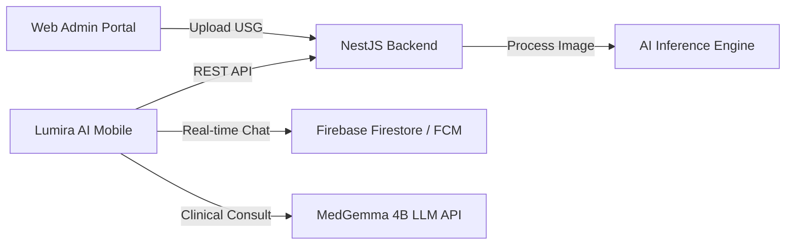

**COMPUTING PROJECT**  
**SOFTWARE REQUIREMENT SPECIFICATION**

**LUMIRA AI MOBILE: ENHANCED BREAST CANCER EARLY DETECTION PLATFORM**

![A logo with a red book and a black backgroundAI-generated content may be incorrect.][image1]

**Project Manager**  
Athila Ramdani Saputra		103012300132

**Team Members**  
Aprilianza Muhammad Yusup	103012300025  
Muhammad Irgiansyah		103012300039  
Arfian Ghifari Mahya   		103012300337  
Jeany Ferliza Nayla    		103012300357  
Gavin Benjiro Ramadhan	103012300452  
Bill Stephen Sembiring		103012330197

**Supervisor**  
WILDA ROYHAN, S.T., M.Kom.

**PROGRAM STUDI S-1 INFORMATIKA**  
**FAKULTAS INFORMATIKA – UNIVERSITAS TELKOM**  
**APRIL 2026**

---

# **Document Version**

| Versi | Tanggal | Perubahan | Penulis |
| :---- | :---- | :---- | :---- |
| 1.0 | 22 April 2026 | Initial SRS Release for Lumira AI Mobile | Kelompok 1 - S1 Informatika |

---

# **Table of Content**

1. [**Introduction**](#1-introduction)
   - [1.1 Purpose](#11-purpose)
   - [1.2 Intended Readers](#12-intended-readers)
   - [1.3 Scope of the System](#13-scope-of-the-system)
2. [**Overall Description**](#2-overall-description)
   - [2.1 Product Perspective](#21-product-perspective)
   - [2.2 Product Functions](#22-product-functions)
   - [2.3 User Classes and Characteristics](#23-user-classes-and-characteristics)
   - [2.4 Operating Environment](#24-operating-environment)
   - [2.5 Design and Implementation Constraints](#25-design-and-implementation-constraints)
   - [2.6 Assumptions and Dependencies](#26-assumptions-and-dependencies)
   - [2.7 Business Rules (Aturan Bisnis)](#27-business-rules-aturan-bisnis)
3. [**System Requirements**](#3-system-requirements)
   - [3.1 Functional Requirements](#31-functional-requirements)
   - [3.2 Non-Functional Requirements (NFR)](#32-non-functional-requirements-nfr)
4. [**External Interface Requirements**](#4-external-interface-requirements)
   - [4.1 User Interface](#41-user-interface)
   - [4.2 Hardware Interface](#42-hardware-interface)
   - [4.3 Software Interface](#43-software-interface)
   - [4.4 Communication Interface](#44-communication-interface)
5. [**Appendix**](#5-appendix)

---

# 1. **Introduction**

## 1.1 **Purpose**
Dokumen Software Requirement Specification (SRS) ini disusun untuk mendefinisikan seluruh kebutuhan fungsional dan non-fungsional dari aplikasi **Lumira AI Mobile**. Dokumen ini ditujukan sebagai acuan utama bagi tim pengembang (developer), desainer UI/UX, analis sistem, penguji (QA/tester), serta pemilik produk dari **PT Dutormasi Membangun Indonesia** dalam proses implementasi, pengujian, dan deployment aplikasi.

## 1.2 **Intended Readers**
Pembaca yang ditargetkan untuk dokumen ini meliputi:
*   **Project Manager**: Untuk memantau perkembangan implementasi fitur sesuai timeline.
*   **Analis Sistem & UI/UX Designer**: Sebagai referensi batasan fitur dan alur kerja antarmuka pengguna.
*   **Developer (Frontend & Backend)**: Sebagai panduan teknis implementasi modul-modul sistem, REST API, dan integrasi database.
*   **QA/Tester**: Sebagai dasar penyusunan skenario pengujian fungsional (*test case*) dan non-fungsional.
*   **Stakeholders (PT Dutormasi Membangun Indonesia & Universitas Telkom)**: Sebagai media validasi kesesuaian sistem yang dikembangkan dengan tujuan bisnis dan akademis.

## 1.3 **Scope of the System**
Lumira AI Mobile merupakan aplikasi seluler lintas platform (Android dan iOS) yang bertindak sebagai *client-side portal* untuk ekosistem deteksi dini kanker payudara berbasis Kecerdasan Buatan (AI). 
*   **Fungsi Utama**: Menyediakan otentikasi berbasis peran (RBAC), dashboard pemantauan kasus medis bagi dokter, riwayat diagnosis medis bagi pasien, visualisasi interpretasi citra USG (Grad-CAM side-by-side) serta penetapan diagnosis akhir oleh dokter, media komunikasi real-time chat berbasis Firebase, serta modul chatbot asisten klinis multimodal menggunakan API Google DeepMind MedGemma 4B.
*   **User Utama**: Dokter Spesialis/Tenaga Medis dan Pasien.
*   **Benefit**: Mempercepat proses diagnosis klinis kanker payudara, meningkatkan transparansi diagnosis kepada pasien, meruntuhkan isolasi komunikasi antara dokter-pasien pasca-pemeriksaan, serta memberikan opsi pendapat kedua (*second opinion*) medis yang cerdas secara instan.

---

# 2. **Overall Description**

## 2.1 **Product Perspective**
Lumira AI Mobile bukan merupakan aplikasi yang berdiri sendiri (*standalone*), melainkan bagian dari ekosistem **Lumira AI Enhanced Platform**. Aplikasi mobile ini bertindak sebagai antarmuka pengguna akhir yang terintegrasi penuh dengan:
1.  **Web Admin Portal**: Tempat Administrator Rumah Sakit mengunggah citra USG pasien dan mengelola registrasi user.
2.  **NestJS/FastAPI Backend Engine**: REST API server yang melayani manajemen data transaksional, auth Supabase, dan komunikasi database.
3.  **AI Inference Engine**: Server deep learning terpisah yang memproses citra USG untuk menghasilkan klasifikasi Normal/Benign/Malignant serta citra interpretasi Grad-CAM Heatmap.
4.  **Firebase Cloud Messaging & Firestore**: Infrastruktur cloud real-time chat dan notifikasi push instan.

## 2.2 **Product Functions**
Fungsi-fungsi utama yang disediakan oleh Lumira AI Mobile meliputi:
1.  **Otentikasi Aman (RBAC)**: Login terenkripsi dengan pembatasan hak akses yang ketat berdasarkan peran (Dokter dan Pasien).
2.  **Dashboard Worklist (Dokter)**: Manajemen antrean kasus pasien berdasarkan kategori status: *Waiting for Review*, *Need Attention*, dan *Done*.
3.  **Portal Pasien**: Tampilan status diagnosis secara real-time (*Pending*, *In Review*, *Done*) beserta hasil laporan klinis.
4.  **Peninjauan Citra USG (Medical Review)**: Visualisasi citra USG asli berdampingan (*side-by-side*) dengan peta panas Grad-CAM untuk transparansi keputusan klinis AI.
5.  **Anotasi ROI & Diagnosis**: Fasilitas dokter untuk menandai Region of Interest (ROI) pada citra dan mengoreksi/menetapkan diagnosis final.
6.  **Komunikasi Konsultasi Real-time**: Fitur chat dua arah terenkripsi antara dokter yang ditugaskan dengan pasien.
7.  **Asisten Chatbot AI (MedGemma)**: Chatbot multimodal yang mampu menerima input teks/gambar medis untuk memberikan pendapat medis kedua (*second opinion*) kepada dokter serta materi edukasi kesehatan terpersonalisasi kepada pasien.

## 2.3 **User Classes and Characteristics**
Aplikasi mobile ini dirancang untuk dua kelas pengguna utama:
*   **Dokter (Tenaga Medis)**:
    *   Karakteristik: Memiliki keahlian medis klinis, membutuhkan efisiensi waktu, membutuhkan visualisasi AI yang transparan (Grad-CAM), memiliki wewenang mutlak untuk menetapkan diagnosis final di sistem.
*   **Pasien**:
    *   Karakteristik: Memiliki keterbatasan pemahaman istilah medis, membutuhkan pemantauan status pemeriksaan yang transparan, membutuhkan sarana komunikasi yang mudah dijangkau dengan dokter, serta memerlukan edukasi pra-konsultasi.

*Catatan: Aktor Administrator Rumah Sakit hanya berinteraksi dengan Web Admin Portal dan bertindak sebagai penyedia data masukan.*

## 2.4 **Operating Environment**
Aplikasi Lumira AI Mobile beroperasi pada lingkungan berikut:
*   **Platform Client**: Mobile Application (Lintas platform: Android 8.0 Oreo ke atas dan iOS 13 ke atas).
*   **Development Framework**: Flutter SDK (Dart) versi 3.5.3 (SDK ^3.5.3) ke atas.
*   **State Management & Routing**: Flutter Riverpod & GoRouter.
*   **Backend Server Environment**: Serverless deployment pada platform **Vercel** (`https://apilumiraai.vercel.app`) untuk transaksional NestJS API, serta secure tunnel **Cloudflare** (`https://tablet-pending-byte-julian.trycloudflare.com`) untuk melayani model LLM MedGemma GPU Server.
*   **Database Management**: Supabase (PostgreSQL) untuk data relasional transaksional & Firebase Cloud Firestore untuk data stream real-time chat.
*   **AI Engine Platform**: Model Deep Learning berbasis PyTorch (FastAPI backend) & Google DeepMind MedGemma 4B Multimodal Model API.
## 2.5 **Design and Implementation Constraints**
Batasan yang membatasi proses desain dan implementasi aplikasi meliputi:
1.  **Kepatuhan Regulasi Privasi**: Sistem wajib patuh pada **UU Pelindungan Data Pribadi (UU PDP) Indonesia No. 27 Tahun 2022** mengenai kerahasiaan riwayat medis pasien (*Protected Health Information*).
2.  **Keamanan Transmisi**: Semua lalu lintas data API transaksional wajib berjalan di atas protokol HTTPS dengan enkripsi TLS 1.3.
3.  **Stateless AI Chatbot**: Layanan API chatbot MedGemma bersifat *stateless* per-sesi interaksi, dengan riwayat chat lokal dipertahankan maksimal 10 pesan terakhir untuk optimasi performa memory client.
4.  **No Direct Upload**: Pasien tidak diizinkan mengunggah citra USG secara mandiri demi menjaga keabsahan klinis citra yang dianalisis oleh sistem.
5.  **No Admin Dashboard**: Aplikasi mobile tidak mencakup pengembangan Admin Dashboard (hanya Dokter dan Pasien, Admin mengakses Web Portal).
6.  **No Typing Indicator**: Fitur *typing indicator* pada chat real-time tidak diimplementasikan demi menyederhanakan kompleksitas latensi sinkronisasi Firebase.
7.  **No Re-consultation**: Fitur konsultasi ulang (*re-consultation*) tidak diimplementasikan pada fase ini.
8.  **Breast Cancer Only**: Dataset AI masih terbatas pada kanker payudara (dominan data perempuan), sehingga pengembangan untuk kasus pasien pria masih dalam riset berkelanjutan.

## 2.6 **Assumptions and Dependencies**
*   **Asumsi**: Koneksi internet stabil selalu tersedia pada perangkat pengguna dokter dan pasien demi menjaga real-time data flow chat dan inferensi AI.
*   **Dependensi Eksternal**:
    *   Ketersediaan layanan pihak ketiga seperti **Firebase Cloud Messaging (FCM)** untuk pengiriman notifikasi instan.
    *   Ketersediaan API publik dari **Google DeepMind MedGemma** untuk beroperasinya chatbot medis.
    *   Integritas data citra USG yang diunggah oleh Admin melalui Web Portal ke dalam bucket storage Supabase.

## 2.7 **Business Rules (Aturan Bisnis)**
Sistem Lumira AI Mobile wajib mematuhi aturan bisnis (*business rules*) berikut dalam setiap transaksi dan alur kerjanya sesuai dengan proposal resmi:
1.  **Hasil AI Bersifat Rekomendatif**: Hasil prediksi AI tidak dapat dijadikan diagnosis definitif tanpa validasi eksplisit dari dokter spesialis yang berwenang. Sistem wajib menampilkan *disclaimer* bahwa AI adalah alat bantu pendukung keputusan klinis.
2.  **Registrasi Pasien Hanya oleh Admin**: Akun dan profil data medis pasien baru hanya dapat didaftarkan oleh pengguna dengan peran Admin melalui portal web. Pasien tidak dapat mendaftarkan diri secara mandiri untuk menjaga integritas data klinis.
3.  **Diagnosis Final Hanya oleh Dokter**: Catatan rekam medis dan penetapan diagnosis akhir (Normal, Benign, atau Malignant) hanya dapat dilakukan oleh Dokter spesialis yang ditugaskan.
4.  **Citra USG Diproses Otomatis Setelah Unggah**: Setiap citra USG baru yang diunggah oleh Admin melalui portal web harus memicu eksekusi otomatis model AI untuk menghasilkan prediksi label dan visualisasi Grad-CAM Heatmap tanpa intervensi manual tambahan.
5.  **Integritas Riwayat Medis**: Seluruh riwayat diagnosis, ROI kuas anotasi, dan percakapan chat transaksional bersifat permanen dan tidak dapat dihapus oleh peran pengguna mana pun demi kepatuhan audit medis jangka panjang.
6.  **Batasan Rekomendasi Chatbot**: Seluruh balasan teks dari MedGemma Chatbot wajib disertai *disclaimer* otomatis di bagian bawah layar presentasi bahwa saran chatbot bersifat edukatif dan bukan pengganti dokter spesialis.
7.  **Akses Terbatas Kasus Pasien**: Dokter spesialis hanya dapat membuka rekam medis dan chat room pasien yang ditugaskan (*assigned*) secara eksplisit kepadanya oleh Admin. Akses lintas kasus pasien tanpa penugasan ditolak oleh kontrol otorisasi API backend.

---

# 3. **System Requirements**

## 3.1 **Functional Requirements**

### A. Modul 1: Secure Authentication & Access Control (RBAC)
Modul ini menangani pendaftaran sesi pengguna, validasi kredensial, dan otorisasi hak akses menu berdasarkan peran pengguna.

| ID | Requirement | Description | Priority | Dependency |
| :--- | :--- | :--- | :--- | :--- |
| **FR-ATH-01** | Login Multi-Role | Sistem harus memungkinkan pengguna masuk menggunakan email dan password yang terdaftar di Supabase Auth. | High | - |
| **FR-ATH-02** | Otorisasi Menu RBAC | Sistem harus membatasi tampilan navigasi dan akses menu berdasarkan peran (Dokter hanya melihat dashboard dokter, Pasien hanya melihat portal pasien). | High | FR-ATH-01 |
| **FR-ATH-03** | Manajemen Sesi Lokal | Sistem harus menyimpan sesi token JWT secara aman di penyimpanan lokal (Secure Storage) agar pengguna tidak perlu login ulang. | Medium | FR-ATH-01 |

### B. Modul 2: Doctor Worklist & Dashboard
Modul ini memfasilitasi dokter dalam melacak tugas diagnosis rekam medis pasien yang masuk.

| ID | Requirement | Description | Priority | Dependency |
| :--- | :--- | :--- | :--- | :--- |
| **FR-DSH-01** | Worklist Klasifikasi Status | Sistem harus menampilkan worklist kasus pasien yang dibagi menjadi tiga tab status: *Waiting for Review*, *Need Attention*, dan *Done*. | High | FR-ATH-02 |
| **FR-DSH-02** | Dashboard Statistik | Sistem harus menyajikan ringkasan statistik real-time berupa jumlah total pasien, pasien yang menunggu review, dan pasien selesai didiagnosis. | Medium | FR-DSH-01 |
| **FR-DSH-03** | Pull-to-Refresh Data | Sistem harus memungkinkan dokter melakukan gestur geser ke bawah (pull-to-refresh) pada halaman stats dan history untuk memperbarui data klinis dari database. | High | FR-DSH-01 |

### C. Modul 3: Medical Review & AI Inference Visualization
Modul utama dokter untuk menganalisis visualisasi interpretasi citra USG kanker payudara oleh AI.

| ID | Requirement | Description | Priority | Dependency |
| :--- | :--- | :--- | :--- | :--- |
| **FR-MED-01** | Visualisasi Side-by-Side | Sistem harus menyajikan tampilan sejajar (*side-by-side*) antara citra USG asli pasien dengan citra visualisasi Grad-CAM Heatmap. | High | FR-DSH-01 |
| **FR-MED-02** | Tampilan Confidence Score | Sistem harus menampilkan persentase tingkat kepercayaan (*confidence score*) hasil prediksi AI untuk tiga kategori kelas (Normal, Benign, Malignant). | High | FR-MED-01 |
| **FR-MED-03** | ROI & Diagnosis Final | Sistem harus memungkinkan dokter menggambar Region of Interest (ROI) pada citra USG dan menetapkan diagnosis klinis akhir (Normal/Benign/Malignant). | High | FR-MED-02 |

### D. Modul 4: Patient Portal & Progress Tracker
Modul khusus bagi pasien untuk melacak kemajuan hasil pemeriksaan medis mereka.

| ID | Requirement | Description | Priority | Dependency |
| :--- | :--- | :--- | :--- | :--- |
| **FR-PTN-01** | Real-time Status Tracker | Sistem harus menampilkan status pemeriksaan pasien saat ini (*Pending*, *In Review*, *Done*) secara visual dan interaktif. | High | FR-ATH-02 |
| **FR-PTN-02** | Akses Riwayat Medis | Sistem harus memberikan akses kepada pasien untuk mengunduh laporan hasil diagnosis final yang telah disetujui oleh dokter. | High | FR-PTN-01 |

### E. Modul 5: Real-time Consultation Chat
Modul komunikasi langsung berbasis obrolan teks antara pasien dan dokter yang berwenang.

| ID | Requirement | Description | Priority | Dependency |
| :--- | :--- | :--- | :--- | :--- |
| **FR-CHT-01** | Obrolan Teks Real-time | Sistem harus memfasilitasi pengiriman dan penerimaan pesan obrolan secara instan antara dokter dan pasien menggunakan Firebase Firestore. | High | FR-ATH-02 |
| **Notifikasi Pesan Baru** | Sistem harus mengirimkan notifikasi push (FCM) dalam waktu < 2 detik ketika terdapat pesan baru masuk saat aplikasi di latar belakang. | Medium | FR-CHT-01 |

### F. Modul 6: MedGemma Multimodal AI Chatbot
Modul asisten klinis cerdas untuk konsultasi medis otomatis berbasis kecerdasan buatan.

| ID | Requirement | Description | Priority | Dependency |
| :--- | :--- | :--- | :--- | :--- |
| **FR-GEM-01** | Konsultasi Teks & Citra | Sistem harus memproses pertanyaan teks medis maupun unggahan citra medis (X-ray/USG) untuk dianalisis oleh MedGemma Chatbot. | High | FR-ATH-02 |
| **FR-GEM-02** | Pembatasan Riwayat Obrolan | Sistem harus membatasi riwayat memori obrolan maksimal 10 pesan terbaru per sesi untuk menjaga efisiensi pemrosesan token MedGemma. | Medium | FR-GEM-01 |
| **FR-GEM-03** | Disclaimer Saran Medis | Sistem wajib menampilkan teks sanggahan (*disclaimer*) otomatis pada bagian bawah antarmuka chat chatbot bahwa respons AI bersifat edukatif dan bukan diagnosis definitif. | High | FR-GEM-01 |

---

## 3.2 **Non-Functional Requirements (NFR)**

### A. Performance Requirements (Kinerja)
*   **Waktu Respon API**: Transaksi data API REST (selain inferensi gambar) harus selesai dalam waktu < 1.5 detik pada jaringan seluler 4G.
*   **Waktu Inferensi AI**: Proses generasi visualisasi Grad-CAM Heatmap dan confidence score di backend AI tidak boleh melebihi 5 detik sejak citra diterima.
*   **Kecepatan Chat**: Pengiriman pesan teks obrolan harus ter-render di layar penerima dalam waktu < 1 detik.

### B. Security Requirements (Keamanan)
*   **Enkripsi Data**: Semua data sensitif pasien (nama, rekam medis, citra diagnosis) wajib dienkripsi saat transit (*TLS 1.3*) dan saat diam di database PostgreSQL menggunakan ekstensi *pgcrypto*.
*   **Otorisasi RBAC**: Sistem harus menolak akses token API dari luar peran yang ditentukan untuk endpoint sensitif (misal: Pasien memanggil endpoint `setDiagnosis()`).
*   **Secure Storage**: Penyimpanan kunci JWT sesi di Flutter client wajib menggunakan enkripsi perangkat keras bawaan (*Key Store* pada Android dan *Key Chain* pada iOS) melalui package `flutter_secure_storage`.

### C. Usability Requirements (Kemudahan Penggunaan)
*   **Desain Ergonomis**: Antarmuka menu navigasi harus mudah dijangkau dengan satu ibu jari tangan pada perangkat seluler (berorientasi portrait).
*   **Kontras & Aksesibilitas**: Skema warna aplikasi harus memenuhi rasio kontras minimal 4.5:1 sesuai standar **WCAG 2.1 Level AA** untuk memudahkan pengguna berusia lanjut atau dengan gangguan penglihatan ringan.

### D. Reliability Requirements (Keandalan)
*   **Ketersediaan Layanan**: Infrastruktur backend Supabase dan REST server harus menjamin uptime minimal 99.9% per bulan.
*   **Sinkronisasi Offline**: Ketika koneksi internet terputus, data chat lokal harus disimpan sementara di penyimpanan lokal Hive dan dikirim ulang secara otomatis setelah koneksi terdeteksi kembali online.

### E. Maintainability Requirements (Kemudahan Pemeliharaan)
*   **Arsitektur Modular**: Kode sumber aplikasi mobile harus mematuhi struktur **Clean Architecture** berbasis fitur (*Feature-First*). Setiap fitur harus memiliki batasan ketat antara lapisan presentasi, domain logic, dan akses data.
*   **Dokumentasi API**: Seluruh endpoint REST API backend harus terdokumentasi dengan standar Swagger/OpenAPI 3.0.

---

# 4. **External Interface Requirements**

## 4.1 **User Interface**
Antarmuka pengguna Lumira AI Mobile mengusung desain premium bertema medis modern dengan skema warna HSL yang menenangkan (Deep Navy Blue, Teal, dan Medical Emerald Green).
*   **Halaman Login**: Menyediakan input text field yang bersih dengan ikon visual, opsi tampilkan/sembunyikan password, dan tombol masuk dengan animasi transisi yang halus.
*   **Dashboard Dokter**: Terdiri dari ringkasan kartu statistik di bagian atas (menggunakan visualisasi *stat cards* interaktif), diikuti oleh tab menu geser (*Swipeable TabBar*) untuk worklist status pasien (*Waiting*, *In Review*, *Done*).
*   **Halaman Medical Review**: Layar dengan tata letak optimal yang menyajikan visualisasi citra asli di sebelah kiri/atas dan visualisasi Grad-CAM di sebelah kanan/bawah, lengkap dengan penggeser transparansi (*opacity slider*) untuk menganalisis area tumor secara interaktif.
*   **Halaman Chatbot MedGemma**: Desain bergaya gelembung obrolan (*chat bubble*) dengan warna berbeda antara pesan pengguna dan respons chatbot, disertai tombol pintasan cepat untuk mengunggah berkas citra medis pendukung.

## 4.2 **Hardware Interface**
*   **Perangkat Kamera**: Aplikasi memerlukan akses izin ke kamera perangkat seluler pasien/dokter apabila ingin mengambil foto citra medis pendukung secara langsung untuk diunggah ke chatbot MedGemma.
*   **Penyimpanan Internal**: Aplikasi memerlukan izin akses ke galeri penyimpanan internal perangkat untuk mengunduh laporan hasil diagnosis dalam format PDF.

## 4.3 **Software Interface**
*   **Firebase SDK (v3.6.0 / v5.4.4)**: Mengintegrasikan Firebase Auth untuk sinkronisasi token custom, Firebase Cloud Firestore untuk sinkronisasi stream real-time chat pada collection `rooms` dan subcollection `messages`, serta Firebase Cloud Messaging (FCM) untuk push notifications.
*   **Supabase Client SDK**: Berperan sebagai otentikasi primer pengguna (login email dan password) serta sinkronisasi data relasional Supabase PostgreSQL.
*   **MedGemma API (Cloudflare Tunnel)**: Menggunakan HTTP client `Dio` (v5.5.0) dengan static bearer token `Bearer XiueX_Lumira+MedWTelU` yang menghubungkan client ke AI model endpoint di `https://tablet-pending-byte-julian.trycloudflare.com/consultations`.
*   **Google Generative AI (v0.4.7)**: Library SDK resmi untuk optimasi parsing respons multimodal Gemini.

## 4.4 **Communication Interface**
*   **RESTful API Services**: Komunikasi transaksional utama ke REST gateway Vercel (`https://apilumiraai.vercel.app`) menggunakan HTTPS dengan payload data terenkripsi berbasis JSON.
*   **Firebase Real-time Stream**: Sinkronisasi pesan konsultasi chat instan Dokter-Pasien melalui WebSocket stream yang dikelola Firebase SDK secara native.
*   **FCM Push Notification API**: Komunikasi real-time ke `/chat/rooms/{roomId}/notify` di backend untuk memicu push notification pada perangkat penerima pesan saat offline.

---

# 5. **Appendix**
*   **Glossary**:
    *   *USG (Ultrasonografi)*: Teknik pemindaian medis menggunakan gelombang suara frekuensi tinggi untuk menghasilkan citra organ dalam tubuh.
    *   *Grad-CAM (Gradient-weighted Class Activation Mapping)*: Teknik visualisasi untuk model Deep Learning (CNN) guna menyoroti area penting pada gambar yang memengaruhi keputusan prediksi klasifikasi model.
    *   *RBAC (Role-Based Access Control)*: Mekanisme pembatasan hak akses sistem berdasarkan peran/jabatan pengguna yang telah ditentukan.
    *   *MedGemma*: Model bahasa besar (LLM) medis tingkat lanjut yang dikembangkan oleh Google DeepMind untuk asisten klinis multimodal.
    *   *FCM (Firebase Cloud Messaging)*: Layanan pengiriman notifikasi lintas platform dari Google.

[image1]: <f:\telu\mobileAppLumira\docs\tugas\image\lumira_logo.png>