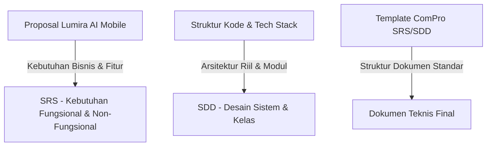

# Panduan Pengerjaan Tugas: Dokumen SRS & SDD Lumira AI Mobile

Dokumen ini berisi panduan, metodologi, dan peta jalan teknis untuk menyelesaikan penyusunan dokumen **Software Requirement Specification (SRS)** pada `ComPro-SRS .md` dan **Software Design Document (SDD)** pada `ComPro-SDD.md` berdasarkan proposal produk (`ComPro - Proposal - Kelompok 1.docx.md`) serta struktur kode asli aplikasi **Lumira AI Mobile** (`f:\telu\mobileAppLumira`).

---

## 1. Metodologi Penyelarasan Dokumen
Untuk menghasilkan dokumen SRS dan SDD berstandar industri dan akademis (Telkom University), pengerjaan dilakukan dengan menyelaraskan tiga sumber utama:

1. **Proposal Bisnis (`ComPro - Proposal - Kelompok 1.docx.md`)**:
   - Diekstrak untuk mengisi bagian latar belakang, rumusan masalah, ruang lingkup, *high-level business requirements*, serta data tim dan pembimbing.
   - Batasan sistem (*constraints*) disesuaikan secara presisi dengan batasan teknis di proposal (misal: stateless chatbot MedGemma, upload citra hanya via Web Admin).

2. **Struktur Kode & Tech Stack Aplikasi (`lib/features/...`)**:
   - Struktur arsitektur menggunakan **Feature-First Clean Architecture** yang modular (pemisahan *Data*, *Domain*, dan *Presentation* layer).
   - Penjelasan modul pada SDD dipetakan langsung dengan folder fitur riil di proyek:
     - `auth/`: Autentikasi dan otorisasi RBAC (Admin, Dokter, Pasien).
     - `dashboard/`: Tampilan dashboard visualisasi status, *stat cards*, dan grafik.
     - `medical_review/`: Panel peninjauan citra USG medis (Grad-CAM side-by-side) & ROI annotation.
     - `chat/`: Chat real-time berbasis WebSocket/FCM.
     - `ai_chatbot/`: Asisten klinis dan pra-konsultasi bertenaga Google DeepMind MedGemma 4B API.

---

## 2. Struktur Pengisian Dokumen

### A. Software Requirement Specification (SRS) - `ComPro-SRS .md`
Dokumen ini difokuskan untuk mendefinisikan *apa* yang harus dibangun oleh sistem tanpa masuk ke detail teknis implementasi internal.
- **Section 1: Introduction**: Menjelaskan visi aplikasi mobile Lumira AI sebagai perpanjangan dari platform web untuk mendongkrak aksesibilitas deteksi dini kanker payudara.
- **Section 2: Overall Description**: Mendefinisikan 3 kelas pengguna utama: **Dokter/Tenaga Medis**, **Pasien**, dan **Web Admin** (sebagai aktor eksternal pengunggah citra).
- **Section 3: System Requirements (Inti Dokumen)**:
  - **Functional Requirements (FR)** dikelompokkan berdasarkan fitur riil dan diberi pengenal unik (misal: `FR-ATH-01`, `FR-MED-02`, `FR-CHT-03`, `FR-GEM-04`) lengkap dengan deskripsi, prioritas (High/Medium/Low), dan dependensinya.
  - **Non-Functional Requirements (NFR)** mencakup metrik performa (respons chat < 2 detik, inferensi AI < 5 detik), keamanan (enkripsi TLS 1.3, autentikasi RBAC), kegunaan (*usability* standar WCAG 2.1), dan keandalan (availability 99.9%).
- **Section 4: External Interface**: Menjabarkan arsitektur komunikasi berbasis REST API (FastAPI/NestJS) dan real-time WebSocket/FCM untuk pertukaran pesan chat.

### B. Software Design Document (SDD) - `ComPro-SDD.md`
Dokumen ini difokuskan untuk mendefinisikan *bagaimana* sistem tersebut dirancang dan diimplementasikan secara teknis.
- **Section 2: System Architecture**:
  - Menggambarkan *High-Level Architecture* (Flutter mobile client terintegrasi dengan NestJS/Node.js backend, Supabase DB, AI Classifier model, dan MedGemma LLM API).
  - Penjelasan arsitektur deployment menggunakan infrastruktur cloud (Digital Ocean, Supabase Auth, Firebase Cloud Messaging).
- **Section 3: Module Design**:
  - Menyajikan tabel komprehensif untuk setiap fitur modul (`auth`, `dashboard`, `medical_review`, `chat`, `ai_chatbot`) lengkap dengan input, output, dan tanggung jawab komponen.
- **Section 4: Class & Sequence Diagram**:
  - Menyajikan diagram alur data/interaksi objek (Sequence Diagram) menggunakan notifikasi sintaks **Mermaid** yang siap dirender untuk alur *Inference USG AI*, *Secure Authentication*, dan *Real-time Consultation Chat*.
- **Section 5: Database Design**:
  - Menyajikan skema fisik tabel database (Supabase/PostgreSQL) yang digunakan untuk menyimpan data pasien, dokter, catatan rekam medis (*medical records*), hasil prediksi AI (confidence score, gradcam URL), dan histori chat.
- **Section 6 & 7: UI & navigation Flow**:
  - Menjelaskan tata letak navigasi *bottom navigation bar* khusus mobile dan alur navigasi dari Login -> Dashboard -> Medical Review/Chat -> Clinical Report.

---

## 3. Langkah Pengerjaan & Eksekusi

1. **Validasi Data Awal**: Memastikan NIM anggota kelompok, nama dosen pembimbing (Wilda Royhan, S.T., M.Kom.), serta detail modul telah sinkron dengan proposal resmi.
2. **Penyusunan SRS (`ComPro-SRS .md`)**:
   - Membuka dan mengedit file `docs/tugas/ComPro-SRS .md`.
   - Mengganti seluruh placeholder `[JUDUL PROJECT]`, nama anggota kelompok, dan instruksi kurung dengan tulisan deskriptif-teknis yang matang, formal, dan profesional.
3. **Penyusunan SDD (`ComPro-SDD.md`)**:
   - Membuka dan mengedit file `docs/tugas/ComPro-SDD.md`.
   - Memetakan arsitektur Feature-First Clean Architecture ke dalam bentuk bagan teks Mermaid dan tabel penjelasan modul.
   - Menuliskan skema database terintegrasi yang riil digunakan dalam database Supabase.
4. **Finalisasi & Uji Integritas Dokumen**:
   - Memastikan format Markdown, Mermaid diagram, dan tabel ter-render dengan sempurna tanpa ada sintaks rusak atau placeholder yang tertinggal.
